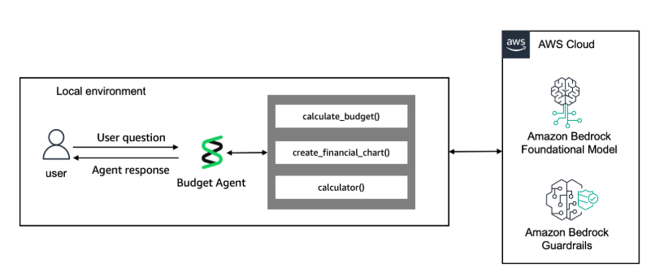
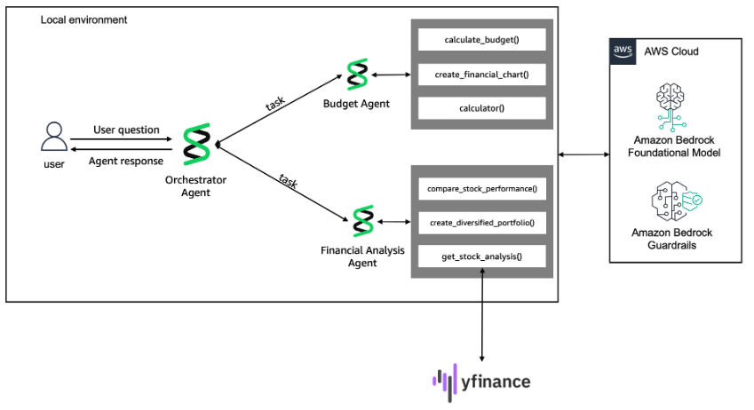
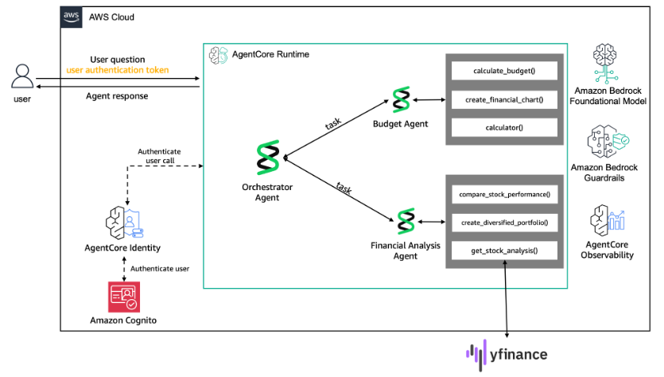

## Building Advanced Agentic Systems on AWS 
### Instructor Demo: 
#### Building and Deploying Intelligent Financial Agents with Amazon Bedrock Strands and AgentCore

This is the Lab/Demo that accompanies the _Building Advanced Agentic Systems on AWS_ course.  These notes provide guidance on how to run the demo, what to highlight, what to look out for, etc.
 
* You can run this on your own account.  Expect around $2 of charges, assuming you stop resources when finished.
* You do NOT need to run the `adv-agentic-ai.yml` CloudFormation template as specified by the lab instructions.  This creates a VPC, SageMaker studio, etc.  Instead, you can run the Jupyter notebooks locally assuming you have tools like Python and VSCode installed.
* Must be run in us-west-2.  I'm not sure why.  I have removed a few cases of (unnecessary) hard-coding.
* The initial Python imports from Task 1 take over 5 minutes to run. Do these first.

## Task 1
General introduction to Strands / Bedrock with single agent.  NO usage of AgentCore. Recommend moving quickly.

* Warning: the imports take 5-10 minutes to run.
* This covers basic strands / bedrock usage, simple agent.
* Guardrails, with message redaction (which is pretty neat)
* Making a simple agent with a purpose: budgeting.
* Strands Conversation Manager (to condense earlier parts of a long conversation.) 
* Streaming vs non-streaming
* Tools
* Structured Output

## Task 2
Multi-agent begins here.  Single orchestrator managing two sub-agents.  No usage of AgentCore.

* This requires the budget-agent produced by Task 1.
* It adds a financial-analysis-agent.
  * It is a bit ironic that the financial-analysis-agent has a guardrail that forbids giving financial advice.
* It defines these both as tools of an orchestrator agent.
* At the end: you have a MONOLITHIC multi-agent system, coordinated by an orchestrator, no AgentCore use.

## Task 3
This task deploys our multi-agent system to AgentCore Runtime

* The multi-agent _monolith_ is only slightly modified from Task 2, mainly to use AgentCore Runtime & Memory.
  * See the line that defines the `app = BedrockAgentCoreApp()` and `@app.entrypoint`.  These are the main concessions to AgentCore Runtime.
  * The `@tool`s are still inline - no use of AgentCore Gateway.
  * The use of AgentCore Memory is very low-level and manual; they are not using the newer memory hook.  This is not necessarily a mistake, note how the implementation embellishes the system prompt with key facts discovered from previous invocations.
* It will use a Cognito User-pool based identity, providing the OIDC token for AuthN.
* The AgentCore Runtime deployment process is demonstrated.
* It deploys it as a single MONOLITH.
* You can ignore the panic about "IMPORTANT: SAVE THESE CREDENTIALS NOW!".  The notebook logic captures what is needed.
* The observed behavior is no different from Task 2.  The relevant points are WHERE the agent is running, and HOW the memory is managed.

## Cleanup 
This is important to cleanup the various artifacts installed in your AWS account, including:
* Cognito User Pool
* AgentCore Memory instance 
* AgentCore Runtime instance
* Bedrock Guardrails
* ECR repo, CodeBuild project.
* S3
* etc.
