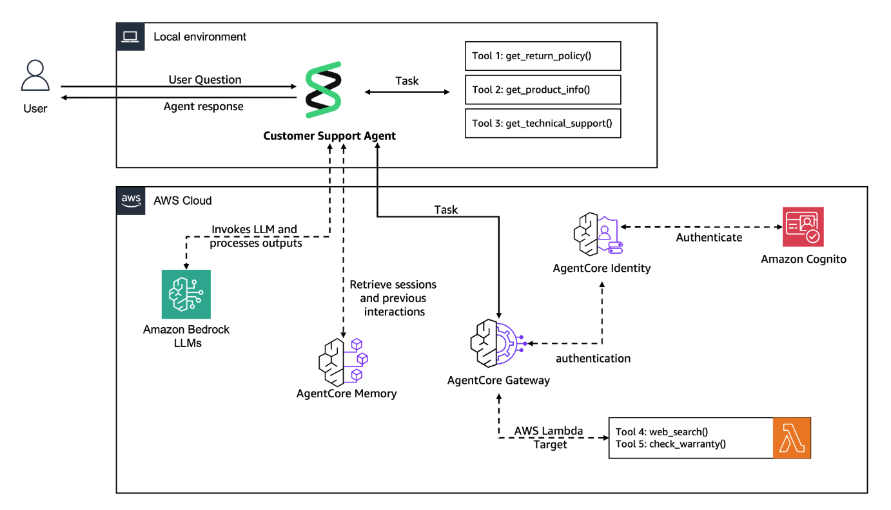
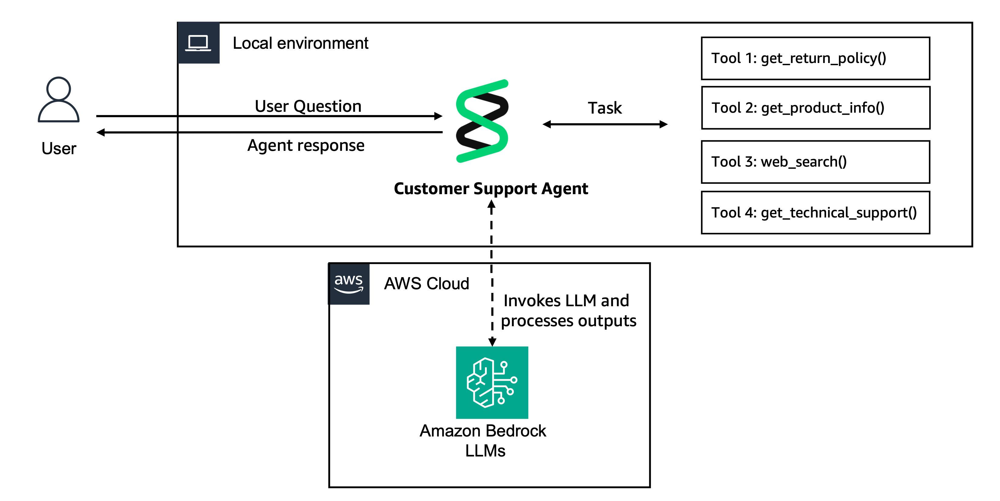
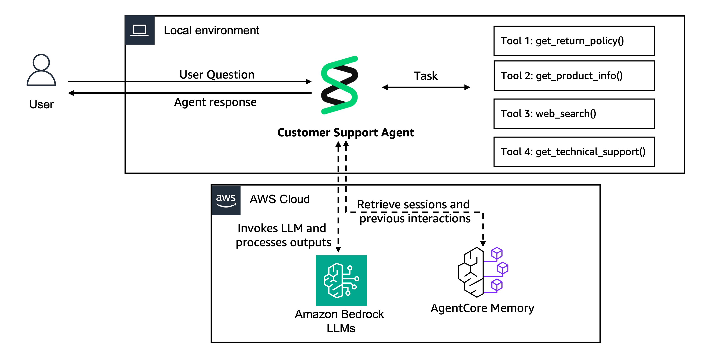
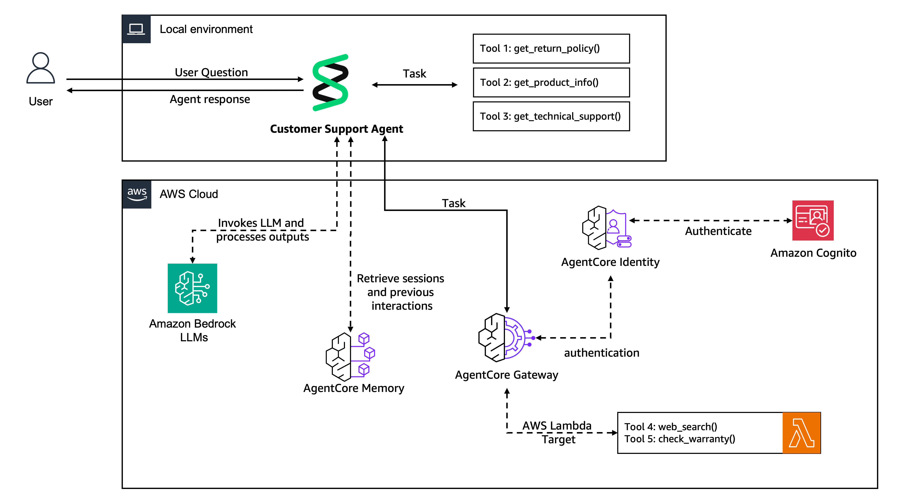

## Building Agentic AI with Amazon Bedrock AgentCore 
### Instructor Demo: 
#### - Enhance and Scale Agents with Amazon Bedrock AgentCore 

This is the Lab/Demo that accompanies the _Building Agentic AI with Amazon Bedrock AgentCore_ course.  These notes provide guidance on how to run the lab/demo, what to highlight, what to look out for, etc.
 
The final architecture looks like this: 

* You can run this on your own account. Charges are minimal: some Lambda, DynamoDB, AC Memory, Cognito...
* Should be run in us-west-2.  Not tested in other regions.  Lambda code is downloaded from a bucket in us-west-2, so this becomes a constraint.
* To complete task 1.3, you will need to create a CloudFormation stack using `lab-setup.template.yaml`.

## Task 1.1
This is just setting up imports, running a simply 'Hello World' agent.
General introduction to Strands / Bedrock with single agent.  NO usage of AgentCore. Recommend moving quickly.

* You'll need to run `pip install -r requirements.txt` the first time.

## Task 1.2 - Add basic memory
The Memory Hook provider is added here.

* This requires Task 1.1 to be complete.
* First they run code to create (or get) the memory resource.  Takes about 2 minutes.
  * Interesting: they have defined two long term memory strategies: user preferences and semantic.
* They seed short term memory with some conversation history.  Interestingly, they do not use the agent to do this, they just pump into memory directly.
* A HookProvider is setup for memory.  WARNING - it isn't what you might expect.  
  * It is build assuming one Agent, one user, one session.  
  * It does NOT attempt to rebuild agent memory for each request like you would do in a multi-threaded application.
  * Instead the `retrieve_customer_context()` simply embellishes the user message with some long term context - it **relies** on the agent preserving message history in memory.
  * The `save_support_interaction()` is more realistic, saving the latest user/assistant pair.
    * They strip out the tool activity.  This would be a big mistake if they were using this to hydrate the conversation later, but they are only using the memory events to prime long-term memory.

## Task 1.3
This task adds Gateway, external tools, and AuthN / AuthZ.  

* You will need to create a CloudFormation stack using `lab-setup.template.yaml`.
* A Cognito User Pool will serve as an OIDC server.  We establish an OIDC client within it.  This code uses SSM parameters to read the URL and client ID.
* You might look at the `gateway_client.create_gateway()` code.
* On the API spec - I think it is odd, but they have implemented two different tools in a single Lambda function.
* Our Agent will get an MCPClient injected into it.  It will point to the Gateway.
* Notice the agent receives only one list of tools, containing local and remote tools.

## Cleanup 
* Delete the cloudformation stack.
* You will need to cleanup the Gateway and Memory resources as they were created in the notebook.  See the final cell in the notebook.